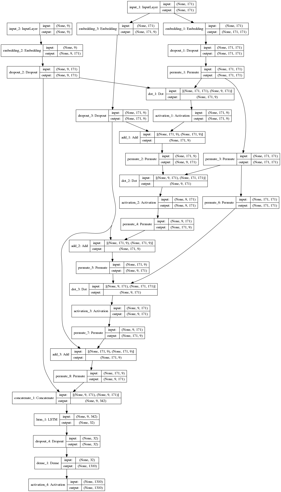
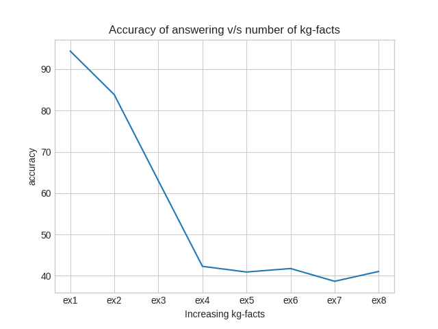

# keras_mn

Memory networks are used for automatic question answering.

The model is trained using kg-facts, question, answer triplets and tested using kg-facts, question to predict the answer.

## Requirements
* nltk==3.2.3
* matplotlib==2.0.2
* Keras==2.0.6
* numpy==1.12.1

## Model plot

## Experiments

* x-axis: We increase kg-facts one-by-one in every experiment.
* y-axis: We see the accuracy of answering questions.(we ask only 1-kg-type question for all the experiments)
* The motive is to see how the accuracy of the memory network model changes when the number of kg-facts are increased. 

