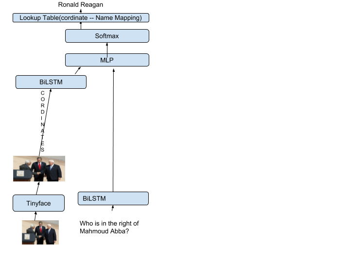
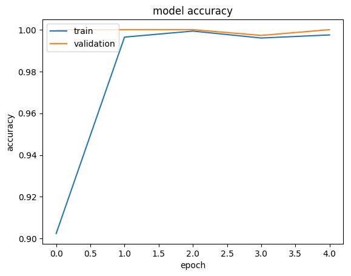
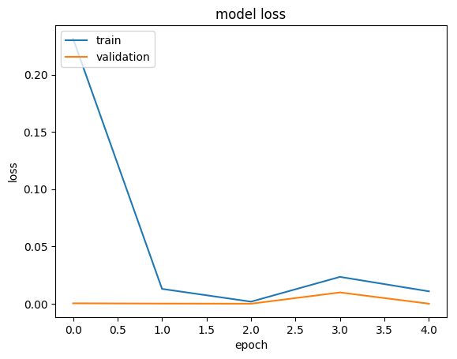
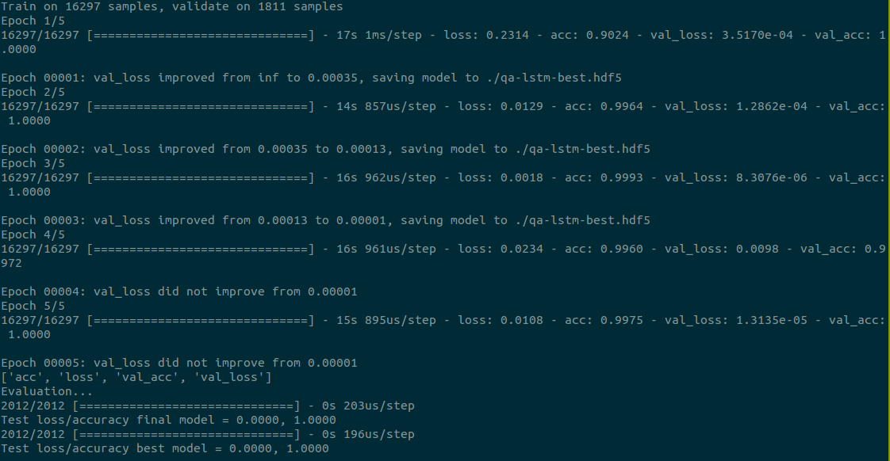

# Spatial Based Visual Question Answering

Given an image as an input, there are times when you want to know "Who is in the leftmost side?", "Who is the person in the image", "Who is standing next to (Person X)", etc. We hereby solve the problem of *Spatial Based Visual Question Answering*!

## The packages required to run the code are as follows
* Python2.7
* Keras
* Tensorflow
* Pandas
* nltk
* skylearn

## File Description
* data_preprocessing.py - This file helps in getting the data in the right format as required by the model. 
* data_generation.py - This file helps in generating dummy data to train / test the model. 
* training_data.py - This file helps in converting the data to vector format, getting question/answer pairs from the data file. 
* training.py - This file contains the code for training and testing the model. 

## Describing the model diagramatically

* Representing Questions: We use Google's pre-trained word2vec model for getting the word embeddings. We pass these embeddings in BiLSTMs to get final representation of the question. 
* We pass the image through Tiny Face(https://github.com/cydonia999/Tiny_Faces_in_Tensorflow) which will give us the cordinates of the faces present in the image. 
* We again use Google's pre-trained model to get embeddings of the integer cordinates. 
* We then pass these embeddings through BiLSTM in an order (from left to right). We use BiLSTMs so that it can remember the context well. By context I mean the ordering. 
* Then we concatenate the two layers (Question and Cordinates), pass it through an MLP and then get the answer by finally passing it through the dense softmax layer. 

## Snippet of the accuracies for the model

